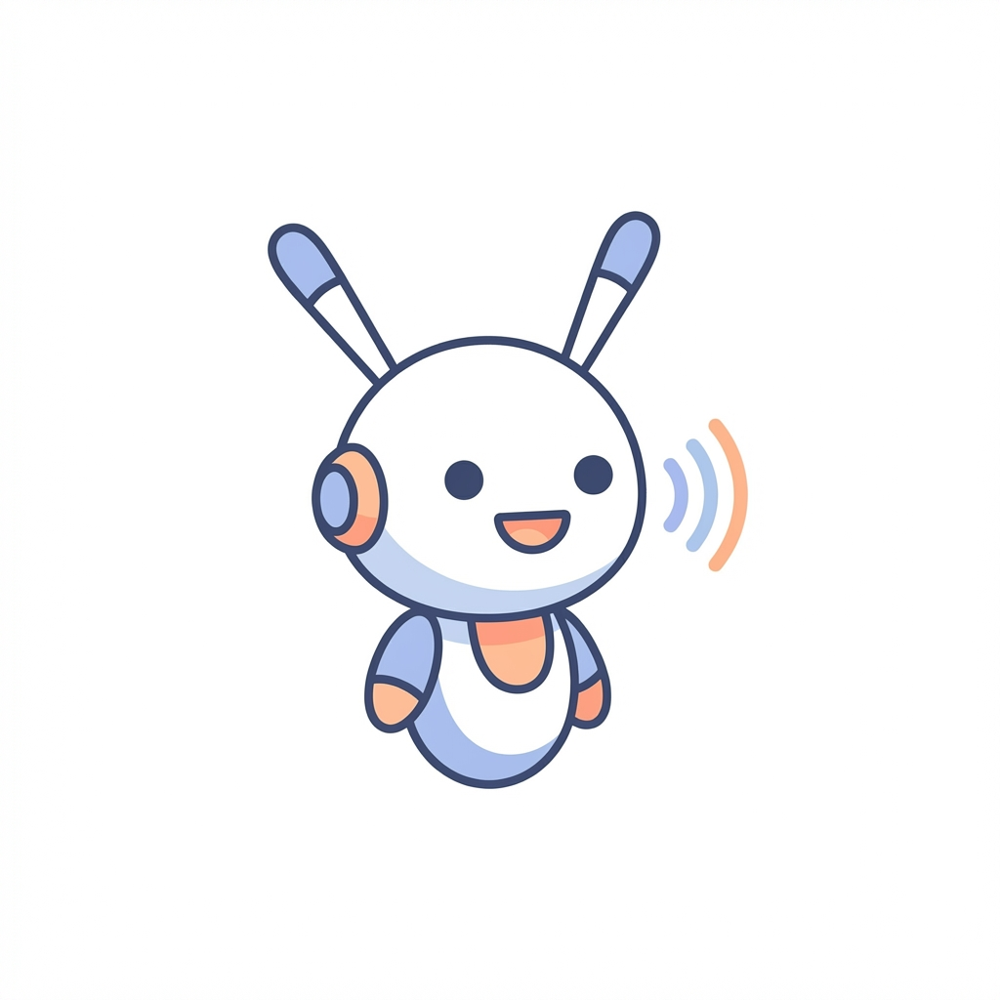

# Reachy Claw

**Reachy Claw turns [Reachy Mini](https://www.pollen-robotics.com/reachy-mini/) into a fully local desktop AI robot that can listen, think, speak, emote, and react in real time.**

[](https://github.com/suharvest/reachy-claw/actions/workflows/ci.yml)
[](https://www.python.org/downloads/)
[](https://www.pollen-robotics.com/reachy-mini/)
[](https://github.com/k2-fsa/sherpa-onnx)
[](https://ollama.com/)
[](LICENSE)

<p align="center">
  
</p>

<!-- TODO: Add a demo GIF below the logo showing the robot reacting to speech -->

Powered by local voice infrastructure and compatible with both [Ollama](https://ollama.com/) and OpenClaw, it brings AI interaction out of the screen and into a physical robot experience.

## Quickstart

```bash
git clone https://github.com/suharvest/reachy-claw.git && cd reachy-claw
uv sync --extra dev --extra audio
ollama pull qwen3.5:2b
uv run reachy-claw
```

That's it — the robot talks using a local LLM via [Ollama](https://ollama.com/). Open `http://localhost:8640` for the dashboard.

For tool use and multi-agent capabilities, you can also use [OpenClaw](https://github.com/ArturSkowronski/openclaw) as the AI backend. See [Configuration](#configuration) for details.

## Dashboard

The built-in web dashboard at `:8640` is the control center — switch modes, tune parameters, and monitor everything in real time.

<!-- TODO: Add dashboard screenshot here -->

### Two Modes

**Conversation mode** — The robot listens, responds, and reacts. Face tracking follows whoever is speaking. Barge-in lets you interrupt mid-sentence. With VLM enabled, the robot can see — ask "what's in front of you?" and it uses its camera to describe the scene.

**Monologue mode** — The robot mumbles to itself about what it sees — no user interaction needed. Great for exhibitions and demos. Vision-driven emotions only, no motor jitter.

Switch between modes with one click in the dashboard.

### What you can configure (all live, no restart needed)

| Category | Settings |
|----------|----------|
| **Mode** | Conversation / Monologue toggle |
| **Voice** | Speaker voice, pitch, speed, volume |
| **Prompts** | System prompts for both modes — fully editable |
| **Motor** | Enable/disable, preset (sensitive / moderate / smart) |
| **Audio** | VAD threshold, energy threshold — tune for your environment |
| **Vision** | VLM (camera vision) on/off, barge-in on/off |
| **Memory** | Conversation history depth (0 = stateless) |
| **Faces** | Register/delete faces, import/export face DB, live camera enroll |

All settings persist across restarts via `runtime-overrides.yaml`.

## Key Features

- **Fully local pipeline** — Paraformer ASR + Matcha TTS via [sherpa-onnx](https://github.com/k2-fsa/sherpa-onnx), runs on Jetson / RK3588 / any CUDA device, no cloud required
- Two AI modes — [Ollama](https://ollama.com/) for zero-setup local LLM, or [OpenClaw](https://github.com/ArturSkowronski/openclaw) for tool use and multi-agent; switch with one click
- **Emotion-driven motion** — 14 distinct emotions mapped to head movements and antenna expressions
- **Face tracking** — MediaPipe-powered gaze following so the robot looks at whoever is speaking
- **Streaming TTS** — sentence-level streaming for low-latency responses
- **Vision (VLM tool calling)** — Ask "what do you see?" and the robot uses Ollama's native tool calling to grab a camera frame, run a vision model (e.g. Qwen 3.5 2B), and describe the scene — all on-device
- **Robust barge-in** — 3-layer noise filtering (energy gate + VAD threshold + cooldown) for reliable interrupts even in noisy environments; toggle on/off live from the dashboard
- **Web dashboard** — live video, ASR transcript, face management, and all settings in one place
- **Pluggable backends** — swap STT/TTS/VAD/LLM without changing code (Paraformer, Matcha, Whisper, ElevenLabs, Ollama, OpenClaw, and more)
- **Plugin architecture** — Motion, Conversation, FaceTracker, Dashboard, and VisionClient as independent plugins
- **Flexible deployment** — Docker Compose on Jetson, standalone, simulator, or via Reachy Mini daemon

## Table of Contents

- [Quickstart](#quickstart)
- [Dashboard](#dashboard)
- [Key Features](#key-features)
- [Latency](#latency)
- [AI Stack](#ai-stack)
- [Architecture](#architecture)
- [Edge Speech Service](#edge-speech-service)
- [Running as a Reachy Mini App](#running-as-a-reachy-mini-app)
- [Configuration](#configuration)
- [Speech Backends](#speech-backends)
- [Installation](#installation)
- [Scripts](#scripts)
- [OpenClaw Skill](#openclaw-skill-action-skill)
- [Development](#development)
- [Key Files](#key-files)
- [Acknowledgements](#acknowledgements)

## Latency

Measured on Jetson Orin NX with CUDA acceleration:

| Stage | Engine | Latency |
|-------|--------|---------|
| Speech detection (VAD) | Silero VAD | ~10ms |
| Speech-to-text | Paraformer streaming (sherpa-onnx) | ~50ms TTFT |
| Text-to-speech | Matcha-TTS + Vocos (sherpa-onnx) | ~60ms TTFT |
| **ASR + TTS combined** | | **~110ms** |

Full voice-to-voice latency (including LLM inference) is typically under 1 second with a 2B parameter model.

## AI Stack

Everything runs locally on edge hardware — no cloud APIs required. Here's the full model inventory:

| Domain | Component | Model | Accelerator | Notes |
|--------|-----------|-------|-------------|-------|
| **Voice AI** | Voice Activity Detection | [Silero VAD](https://github.com/snakers4/silero-vad) | CPU (ONNX) | ~10ms latency |
| | Speech-to-Text (streaming) | [Paraformer](https://github.com/k2-fsa/sherpa-onnx) / [Zipformer](https://github.com/k2-fsa/sherpa-onnx) | CUDA | Paraformer: zh+en ~50ms TTFT; Zipformer: en ~50ms TTFT |
| | Text-to-Speech | [Matcha-TTS](https://github.com/k2-fsa/sherpa-onnx) + Vocos / [Kokoro](https://github.com/k2-fsa/sherpa-onnx) | CUDA | Matcha: zh+en ~60ms TTFT; Kokoro: en ~130ms TTFT |
| **LLM** | Conversational AI | [Qwen 3.5 2B](https://huggingface.co/Qwen) | CUDA (Ollama) | On-device; swappable to any Ollama/OpenClaw model |
| **Vision AI** | Face Detection | [SCRFD-2.5D](https://github.com/deepinsight/insightface) | TensorRT | Real-time multi-face detection |
| | Face Embedding | [ArcFace MBF (W600K)](https://github.com/deepinsight/insightface) | TensorRT | Face recognition & re-identification |
| | Emotion Detection | [EfficientNet-B0 (AFEW)](https://github.com/HSE-asavchenko/face-emotion-recognition) | TensorRT | 8-class facial emotion classification |
| | Face Tracking (client) | [MediaPipe Face Detection](https://ai.google.dev/edge/mediapipe/solutions/guide) | CPU | Gaze following on the robot side (as fallback) |

The STT/TTS pipeline is powered by **[Jetson Voice](https://github.com/suharvest/jetson-local-voice)** — a standalone Docker service built on [sherpa-onnx](https://github.com/k2-fsa/sherpa-onnx) that handles ASR and TTS inference with CUDA acceleration. VAD runs locally on the client side (reachy-claw) via ONNX Runtime — no network round-trip needed for speech detection. See [Edge Speech Service](#edge-speech-service) for setup.

The vision pipeline runs in the **vision-trt** container using TensorRT-optimized models for face detection, embedding, and emotion recognition.

## Architecture

Reachy Claw is the client-side runtime. The AI backend is swappable — Ollama or OpenClaw:

```text
┌─────────────────────────────────────────────────────────────────────┐
│  reachy-claw (this project)                                         │
│                                                                     │
│  Plugins:                                                          │
│    ConversationPlugin — mic → VAD → STT → [LLM] → TTS → speaker  │
│    MotionPlugin       — emotions, head tracking, idle animations    │
│    FaceTrackerPlugin  — MediaPipe face detection → head gaze        │
│                                                                     │
│  Shared state:                                                     │
│    HeadTargetBus  — fuses face/DOA/neutral head targets             │
│    EmotionMapper  — 14 emotions → head+antenna poses                │
│    HeadWobbler    — speech-driven head micro-movements              │
└──────┬──────────────────┬───────────────┬────────────┬──────────────┘
       │                  │               │            │
       ▼                  ▼               ▼            ▼
 Reachy Mini SDK    Speech Service    Ollama        OpenClaw Gateway
 (reachy-mini)      (jetson-voice)    (local LLM)   (openclaw)
                                      ─── OR ───
```

The `[LLM]` block in the pipeline is a pluggable interface: `OllamaClient` calls Ollama's HTTP API directly; `DesktopRobotClient` connects to OpenClaw via WebSocket. Both implement the same streaming response protocol, so the rest of the pipeline (STT, TTS, motion, barge-in) works identically.

### Related Projects

| Project | Role | Default Port | Protocol |
|---------|------|-------------|----------|
| **[reachy-claw](https://github.com/suharvest/reachy-claw)** (this) | Client runtime — plugins, STT/TTS pipeline, robot control | — | — |
| **[Ollama](https://ollama.com/)** | Local LLM inference (optional, for Ollama mode) | `:11434` | HTTP |
| **[OpenClaw](https://github.com/ArturSkowronski/openclaw)** | AI gateway — LLM, tools, multi-turn conversation (optional, for OpenClaw mode) | `:18789` (gateway) | HTTP |
| ↳ desktop-robot extension | WebSocket bridge for voice assistants | `:18790` | `ws://.../desktop-robot` |
| **[Jetson Voice](https://github.com/suharvest/jetson-local-voice)** | Edge speech — Paraformer ASR + Matcha TTS (sherpa-onnx, CUDA) | `:8621` | HTTP REST |
| **reachy-mini daemon** | Robot hardware — SDK access, motor control | `:8000` (dev) / `:38001` (Jetson) | Zenoh `:7447` |

### Plugins

| Plugin | Purpose | Depends on |
|--------|---------|------------|
| `ConversationPlugin` | Full conversation loop: mic → VAD → STT → LLM (Ollama or OpenClaw) → TTS → speaker. Handles barge-in, emotions, and robot commands. | Ollama or OpenClaw, Speech service |
| `MotionPlugin` | Executes emotion expressions (head + antenna), fused head tracking, idle animations. | Reachy Mini SDK |
| `FaceTrackerPlugin` | MediaPipe face detection → HeadTarget published to HeadTargetBus. | Camera |
| `DashboardPlugin` | Web dashboard with live video, ASR transcript, robot state, and settings UI. | — |
| `VisionClientPlugin` | Connects to vision-trt via ZMQ for face/emotion data and smile capture events. | vision-trt |

### WebSocket Protocol (desktop-robot)

reachy-claw connects to OpenClaw's desktop-robot extension via WebSocket.

**Passive emotion channel** — The LLM includes `[emotion:happy]` tags in its responses. The extension strips them from the text stream and sends a separate `emotion` message. reachy-claw receives it and immediately queues the expression — zero extra round-trip.

```text
LLM output: "[emotion:happy] Sure, I'd love to help!"
  → extension sends:  {"type": "emotion", "emotion": "happy"}
  → extension sends:  {"type": "stream_delta", "text": "Sure, I'd love to help!"}
  → reachy-claw:      queue_emotion("happy") → MotionPlugin executes head+antenna pose
```

**Active robot commands** — User says "do a dance", LLM calls a `reachy_*` tool, extension forwards it as `robot_command` for client-side execution:

```text
LLM tool call: reachy_dance({dance_name: "celebrate"})
  → extension sends:  {"type": "robot_command", "action": "dance", "params": {...}, "commandId": "..."}
  → reachy-claw:      execute dance routine → send robot_result back
```

Available actions: `move_head`, `move_antennas`, `play_emotion`, `dance`, `capture_image`, `status`. See `action-skill/SKILL.md` for the full tool interface.

### Data Flow

```text
Microphone → VAD (Silero) → Speech detected?
  → STT (Paraformer streaming) → text
  → LLM (Ollama HTTP or OpenClaw WebSocket) → AI response (streaming)
  → Sentence splitter → TTS (Matcha, streaming) → Speaker
                       → EmotionMapper → Robot head/antennas

Camera → MediaPipe → HeadTarget → HeadTargetBus → Robot head
TTS audio → HeadWobbler → speech roll/pitch/yaw → Robot head

Barge-in: energy gate → VAD probability → confirm frames → interrupt TTS → new turn
```

### Jetson Deployment (Docker Compose)

On Jetson, all services run as containers with `network_mode: host`. A single `docker-compose.yml` manages everything — OpenClaw is an opt-in profile:

```bash
# Ollama mode (default — 2 containers)
docker compose up -d

# OpenClaw mode (3 containers)
docker compose --profile openclaw up -d

# + Vision (face detection, emotion recognition, smile capture)
docker compose --profile vision up -d

# OpenClaw + Vision
docker compose --profile openclaw --profile vision up -d
```

| Container | Profile | Ports | Purpose |
|-----------|---------|-------|---------|
| `reachy-daemon` | always | `:38001` (FastAPI), `:7447` (Zenoh) | Robot hardware control |
| `reachy-claw` | always | `:8640` (dashboard), `:8641` (API) | Conversation + dashboard |
| `speech` (external) | always | `:8621` | STT/TTS (sherpa-onnx) |
| `openclaw-gateway` | `openclaw` | `:18789`, `:18790` | AI gateway (LLM + tools) |
| `vision-trt` | `vision` | `:8630` (API), `:8631` (ZMQ), `:8632` (stream) | TensorRT face/emotion pipeline |

One-click deploy from your laptop:

```bash
cd deploy/jetson

./deploy.sh                    # Ollama mode
./deploy.sh --openclaw         # OpenClaw mode
./deploy.sh --setup-openclaw   # OpenClaw + first-time extension setup
```

#### Kiosk Mode (exhibition)

Auto-launch the dashboard in fullscreen on Jetson boot:

```bash
# Install from your laptop (remote)
bash deploy/jetson/kiosk/install.sh user@jetson-ip

# Or install locally on the Jetson
bash deploy/jetson/kiosk/install.sh
```

This installs a GNOME autostart entry that waits for the dashboard to be ready, then opens Chromium in kiosk mode.

See `deploy/jetson/` for Dockerfiles and compose config.

## Edge Speech Service

The speech service is maintained as a standalone project: **[Jetson Voice](https://github.com/suharvest/jetson-local-voice)** — a Docker-based voice stack that runs Paraformer ASR and Matcha TTS on Jetson (or any CUDA device) with sherpa-onnx.

```bash
# On your edge device (e.g. Jetson Orin NX, JetPack 6.2)
git clone https://github.com/suharvest/jetson-local-voice.git
cd jetson-local-voice
docker compose build && docker compose up -d
curl http://localhost:8000/health
```

Then point reachy-claw at it:

```bash
uv run reachy-claw \
  --stt paraformer-streaming \
  --tts matcha \
  --speech-url http://<device-ip>:8000
```

See the [Jetson Voice README](https://github.com/suharvest/jetson-local-voice) for full API docs, benchmarks, model comparison, and patched sherpa-onnx details.

## Running as a Reachy Mini App

This project can run in two ways:

### Direct (development / standalone)

```bash
uv run reachy-claw --gateway-host 192.168.1.100
```

The app manages the Reachy Mini connection itself.

### Via Reachy Mini Daemon (production)

The project registers as a Reachy Mini app via the `reachy_mini_apps` entry point. Install it into the daemon's environment:

```bash
pip install /path/to/reachy-claw
```

Then start via the daemon API:

```bash
# List available apps
curl http://localhost:8000/apps/list-available

# Start
curl http://localhost:8000/apps/start-app/reachy_claw

# Stop
curl http://localhost:8000/apps/stop-current-app
```

Or run directly as a Reachy Mini app (daemon must be running):

```bash
python -m reachy_claw.reachy_app
```

In daemon mode, the Reachy Mini connection is managed by the daemon and passed to the app.

## Configuration

Most settings can be changed live through the [Dashboard](#dashboard) — no restart needed. For initial setup or headless deployment, use the YAML config file.

Configuration is layered (highest priority wins):

**CLI args > Environment variables > Dashboard overrides > YAML config file > Defaults**

Dashboard changes are saved to `runtime-overrides.yaml` automatically and persist across restarts.

### YAML config file

Copy the example and edit:

```bash
cp reachy-claw.example.yaml reachy-claw.yaml
```

The app auto-detects config files in this order:
1. `./reachy-claw.yaml` or `./reachy-claw.yml` (current directory)
2. `~/.reachy-claw/config.yaml`

Or specify explicitly:

```bash
reachy-claw --config /path/to/config.yaml
# or
export REACHY_CLAW_CONFIG=/path/to/config.yaml
```

Example: **Ollama mode** (simplest — no gateway needed):

```yaml
llm:
  backend: ollama
  model: qwen3.5:2b
  max_history: 5

vad:
  backend: silero
```

Example: **OpenClaw mode** (full features, edge deployment with Jetson):

```yaml
llm:
  backend: gateway             # default — use OpenClaw

gateway:
  host: 192.168.1.100
  port: 18790

stt:
  backend: paraformer-streaming
  speech_service_url: http://192.168.1.50:8621

tts:
  backend: matcha
  speech_service_url: http://192.168.1.50:8621
  matcha:
    speaker_id: 0
    speed: 1.2

vad:
  backend: silero

behavior:
  wake_word: hey reachy
  play_emotions: true

vision:
  tracker: mediapipe
  camera_index: 0
```

See `reachy-claw.example.yaml` for the full list of 70+ options.

### Environment variables

| Variable | Description |
|---|---|
| `OPENCLAW_HOST` | Gateway host (default: `127.0.0.1`) |
| `OPENCLAW_PORT` | Gateway port (default: `18790`) |
| `OPENCLAW_TOKEN` | Gateway auth token |
| `OPENCLAW_PATH` | WebSocket path (default: `/desktop-robot`) |
| `STT_BACKEND` | STT backend (default: `paraformer-streaming`) |
| `TTS_BACKEND` | TTS backend (default: `matcha`) |
| `SPEECH_SERVICE_URL` | Remote speech service URL |
| `WHISPER_MODEL` | Whisper model size: `tiny`, `base`, `small`, `medium`, `large` |
| `WAKE_WORD` | Wake word to activate listening |
| `OPENCLAW_OPENAI_TOKEN` / `OPENAI_API_KEY` | OpenAI API key (for `--stt openai`) |
| `REACHY_CLAW_CONFIG` | Path to YAML config file |

Backend-specific env vars are auto-generated from each backend's `Settings` class (e.g. `MATCHA_SPEAKER_ID`, `MATCHA_SPEED`, `SENSEVOICE_LANGUAGE`).

ElevenLabs TTS:
- `REACHY_ELEVENLABS_API_KEY` or `ELEVENLABS_API_KEY` (required)
- `REACHY_ELEVENLABS_VOICE_ID` or `ELEVENLABS_VOICE_ID` (optional)
- `REACHY_ELEVENLABS_MODEL_ID` or `ELEVENLABS_MODEL_ID` (optional)
- `REACHY_ELEVENLABS_OUTPUT_FORMAT` or `ELEVENLABS_OUTPUT_FORMAT` (optional)

### CLI options

```text
-c, --config          Path to YAML config file
-v, --verbose         Debug logging
--gateway-host        OpenClaw host (default: 127.0.0.1)
--gateway-port        OpenClaw port (default: 18790)
--gateway-token       Auth token
--reachy-mode         auto | localhost_only | network
--stt                 (choices auto-detected from registry)
--whisper-model       tiny | base | small | medium | large
--tts                 (choices auto-detected from registry)
--tts-voice           Voice ID (backend-specific)
--tts-model           Model path (for Piper)
--speech-url          Remote speech service URL
--audio-device        Input device name
--vad                 silero | energy
--wake-word           Wake phrase
--no-emotions         Disable emotion animations
--no-idle             Disable idle animations
--no-barge-in         Disable barge-in
--no-face-tracking    Disable face tracking
--tracker-type        mediapipe | none
--camera-index        Camera device index
--standalone          Run without gateway
--demo                Run robot movement demo and exit
```

## Speech Backends

Backends are discovered automatically via the `@register_tts` / `@register_stt` / `@register_vad` decorators in `backend_registry.py`.

### STT backends

| Name | Type | Description |
|---|---|---|
| **`paraformer-streaming`** | Remote (sherpa-onnx) | **Default.** Streaming ASR, bilingual zh+en, ~50ms TTFT |
| `sensevoice` | Remote (sherpa-onnx) | Offline ASR, 5 languages (zh/en/ja/ko/yue) |
| `whisper` | Local | OpenAI Whisper |
| `faster-whisper` | Local | CTranslate2-optimized Whisper |
| `openai` | Cloud | OpenAI Whisper API |

### TTS backends

| Name | Type | Description |
|---|---|---|
| **`matcha`** | Remote (sherpa-onnx) | **Default.** Matcha-TTS + Vocos, best Chinese quality, ~60ms TTFT |
| `kokoro` | Remote (sherpa-onnx) | Kokoro TTS, multilingual |
| `elevenlabs` | Cloud | ElevenLabs API |
| `macos-say` | Local | macOS built-in `say` command |
| `piper` | Local | Piper neural TTS |
| `none` | -- | Dummy (prints text, no audio) |

### VAD backends

| Name | Type | Description |
|---|---|---|
| **`silero`** | Local (ONNX) | **Default.** Silero VAD, accurate speech detection |
| `energy` | Local | Simple RMS energy threshold |

### Adding a new backend

Create a class in `tts.py` or `stt.py` with the decorator -- that's it:

```python
@register_tts("my-backend")
class MyTTS(TTSBackend):
    """My custom TTS backend."""

    # Optional: declare backend-specific config fields
    class Settings:
        api_key: str = ""
        voice_type: str = "default"

    def __init__(self, base_url="http://localhost:8000", api_key="", voice_type="default"):
        self._base_url = base_url
        self._api_key = api_key
        self._voice_type = voice_type

    async def synthesize(self, text: str) -> str:
        # Call your API, return path to temp audio file
        ...
```

This automatically provides:
- `--tts my-backend` CLI option
- `tts.my_backend_api_key` / `tts.my_backend_voice_type` in YAML config
- `MY_BACKEND_API_KEY` / `MY_BACKEND_VOICE_TYPE` environment variables
- `config.my_backend_api_key` / `config.my_backend_voice_type` config attributes

## Installation

### Prerequisites

- Python 3.10+
- Reachy Mini SDK (`reachy-mini`)
- For edge speech: a CUDA device running the [Jetson Voice](https://github.com/suharvest/jetson-local-voice) speech service (see [Edge Speech Service](#edge-speech-service))

### Install the main app

```bash
uv sync
```

Development install:

```bash
uv sync --extra dev
```

### Optional extras

- local mic input: `uv sync --extra audio`
- local faster transcription: `uv sync --extra local-stt`
- OpenAI cloud transcription: `uv sync --extra cloud-stt`
- Reachy vision extras: `uv sync --extra vision`
- MediaPipe face tracking: `uv sync --extra mediapipe-vision`
- MuJoCo simulator: `uv sync --extra sim`

## Scripts

| Script | Purpose |
|---|---|
| `scripts/run_sim.sh` | Launch MuJoCo simulator + gateway check + start app (no face tracking) |
| `scripts/run_real.sh` | Pre-flight checks (gateway, Jetson, Reachy gRPC) + start with edge speech |
| `scripts/run_sim_daemon.py` | MuJoCo simulator daemon (macOS, GStreamer shim) |

## OpenClaw Skill (`action-skill/`)

The `action-skill/SKILL.md` describes the robot control tools available to OpenClaw's LLM. Give this file to your OpenClaw agent so it knows what it can do:

- `reachy_move_head` / `reachy_move_antennas` — direct motor control
- `reachy_play_emotion` — 14 emotions expressed as head+antenna poses
- `reachy_dance` — 5 choreographed routines (nod, wiggle, celebrate, curious_look, lobster)
- `reachy_capture_image` — camera snapshot
- `reachy_status` — connection state and live positions

No Python code in this directory — it's a pure interface description. Execution happens in reachy-claw's ConversationPlugin via the `robot_command` WebSocket channel.

## Development

```bash
uv sync --extra dev
uv run pytest
uv tool run ruff check .
```

## Key Files

| File | Purpose |
|---|---|
| `src/reachy_claw/main.py` | CLI entrypoint |
| `src/reachy_claw/app.py` | ReachyClawApp orchestrator |
| `src/reachy_claw/reachy_app.py` | Reachy Mini daemon app adapter |
| `src/reachy_claw/gateway.py` | OpenClaw WebSocket protocol (emotion + robot_command channels) |
| `src/reachy_claw/llm.py` | Ollama LLM client (HTTP streaming, conversation history) |
| `src/reachy_claw/plugins/conversation_plugin.py` | Conversation loop + robot command handlers |
| `src/reachy_claw/plugins/motion_plugin.py` | Emotion execution + head tracking fusion |
| `src/reachy_claw/plugins/face_tracker_plugin.py` | MediaPipe face detection → HeadTarget |
| `src/reachy_claw/motion/emotion_mapper.py` | 14 emotions → head+antenna poses |
| `src/reachy_claw/motion/dances.py` | 5 dance routines (choreographed movement sequences) |
| `src/reachy_claw/motion/head_target.py` | HeadTargetBus — fused head target from multiple sources |
| `src/reachy_claw/motion/head_wobbler.py` | Speech-driven head micro-movements |
| `src/reachy_claw/backend_registry.py` | Auto-discovery registry for STT/TTS/VAD backends |
| `src/reachy_claw/config.py` | Configuration (YAML + env + CLI, 70+ options) |
| `src/reachy_claw/plugins/dashboard_plugin.py` | Web dashboard — video proxy, WebSocket state, settings |
| `src/reachy_claw/plugins/vision_client_plugin.py` | Vision-TRT ZMQ client — face/emotion/capture relay |
| `action-skill/SKILL.md` | OpenClaw tool interface for LLM-driven robot control |
| `deploy/jetson/` | Dockerfiles + compose for Jetson deployment |
| `deploy/jetson/kiosk/` | Kiosk autostart scripts for exhibition displays |

## Acknowledgements

This project was originally based on [clawd-reachy-mini](https://github.com/ArturSkowronski/clawd-reachy-mini) by [Artur Skowronski](https://github.com/ArturSkowronski).

- [OpenClaw](https://github.com/ArturSkowronski/openclaw) -- AI gateway framework
- [sherpa-onnx](https://github.com/k2-fsa/sherpa-onnx) -- speech inference engine (Paraformer ASR, Matcha TTS, Silero VAD)
- [Pollen Robotics](https://www.pollen-robotics.com/) -- Reachy Mini hardware and SDK
- [MediaPipe](https://ai.google.dev/edge/mediapipe/solutions/guide) -- face detection and tracking
- [OpenAI Whisper](https://github.com/openai/whisper) -- speech-to-text
- [ElevenLabs](https://elevenlabs.io/) / [Piper](https://github.com/rhasspy/piper) -- text-to-speech engines
