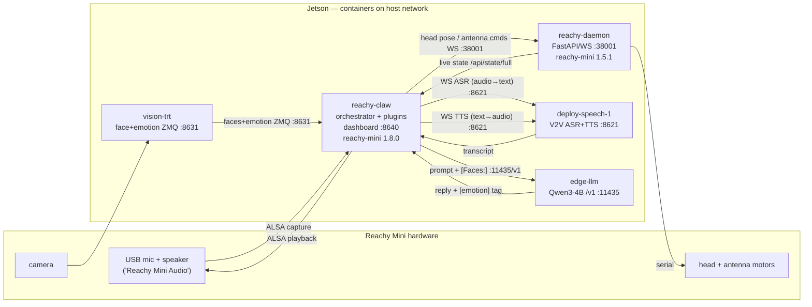

# Architecture

How the pieces of this project actually fit together at runtime — what each
component is, which versions run where, and how they talk. Written against the
**SLV exhibition deployment** on the Jetson (the live config in
`deploy/jetson/reachy/reachy-claw.jetson.slv.yaml`), which is the production
shape today.

> Naming note: the project is `reachy-claw`. The "claw" comes from **OpenClaw /
> Clawd** (`reachy_claw.reachy_app.ClawdReachyMiniApp`), the AI gateway it was
> originally built on. The current SLV deployment no longer uses OpenClaw — it
> runs edge-llm + seeed-local-voice — so the name is historical. See
> "Naming" at the bottom.

## Components (live on the Jetson, all on the host network)

Every container shares the host network, so they reach each other on
`localhost:<port>`.

| Container | Image (tag) | Role | Key dep | Port / protocol |
|---|---|---|---|---|
| **reachy-claw** | `…/reachy-claw:slv-v7` | Orchestrator: runs `ReachyClawApp` + all plugins; owns the audio device; drives the conversation loop and the dashboard | reachy-mini **1.8.0** (client SDK) | `:8640` dashboard (HTTP) |
| **reachy-daemon** | `…/reachy-daemon:v1.0` | Robot hardware server: motors, sensors, head/antenna control; serves live robot state | reachy-mini **1.5.1** (daemon) | `:38001` FastAPI / WebSocket |
| **deploy-speech-1** | `seeed-local-voice:prod-unified-v8` | SLV V2V engine: streaming ASR + TTS | sherpa-onnx | `:8621` WS (`/v2v/stream`) + HTTP |
| **edge-llm-chat-service** | `…/edge-llm-chat-service:v0.3.0` | LLM inference, OpenAI-compatible (Qwen3-4B-AWQ) | TensorRT | `:11435` HTTP (`/v1`) |
| **vision-trt** | `…/vision-trt:v2.1` | Camera face detection + emotion, published over ZMQ | TensorRT | `:8631` ZMQ (`tcp://`) |

### The reachy-mini version split (the thing that looks messy)

`reachy-mini` is installed in **two** containers, at **different versions**:

- **reachy-claw → 1.8.0** (the *client* SDK: `ReachyMini`, `MediaManager`,
  `create_head_pose`). It landed at 1.8.0 because the image builds with
  `pip install .` and, until now, `pyproject` only pinned `reachy-mini>=1.2.0`,
  so pip grabbed the newest available at build time.
- **reachy-daemon → 1.5.1** (the *daemon*: the `reachy-mini-daemon` process that
  talks to the motors). It is a separately-built image (`reachy-daemon:v1.0`).

**Why this is OK:** the client↔daemon transport is WebSocket from SDK 1.5.0
onward, and the API the client uses is stable across 1.5→1.8. Verified live:
`/api/state/full` returns real head pose / body yaw / antenna data, no
version-mismatch warnings, no errors. So 1.8.0 client ↔ 1.5.1 daemon
interoperate fine.

**What is still untidy:** nothing pins these two together. `pyproject` now
explicitly requires `reachy-mini>=1.8.0` for the client (reproducible), but the
daemon image floats independently. Aligning the daemon to 1.8.0 is optional
(tracked by the `--no-media` TODO in `deploy/jetson/reachy/docker-compose.yml`).

## Data flow

### Conversation loop (the main path)
1. **Listen** — USB mic → `reachy-claw` `AudioCapture` with client-side VAD
   (silero, 700 ms pre-roll). No wake word; a *visual attention* gate (from
   vision) opens a short window where short utterances may trigger.
2. **Transcribe** — audio streamed to the SLV engine over `ws://localhost:8621/v2v/stream` → text.
3. **Think** — text + face context (`[Faces: …]`) sent to edge-llm at
   `http://localhost:11435/v1` (Qwen3-4B). Reply is one short sentence ending in
   one emotion tag, e.g. `[happy]`.
4. **Speak** — reply text → SLV TTS (same `:8621`) → audio → played back through
   the ALSA duplex that `reachy-claw` owns (`media_backend: no_media` keeps the
   reachy-mini SDK off the audio device so it doesn't fight the duplex).
5. **Emote / move** — the emotion tag drives the **motion compositor** (gaze
   anchor + emotion accent + speech wobble) → head pose → `reachy-daemon`
   `:38001` → motors.

### Vision / attention loop (parallel)
Camera → `vision-trt` → face boxes + emotion over ZMQ `:8631` → `reachy-claw`
`face_tracker` plugin → (a) gaze target for the head compositor, (b) the visual
attention gate for the conversation, (c) `[Faces: …]` context for the LLM.

### Control loop (closed loop = "回流")
`reachy-claw` issues head/antenna targets to `reachy-daemon` over WebSocket; the
daemon drives the motors over serial and publishes live state
(`/api/state/full`: head pose, body yaw, antenna positions, `control_mode`).
This sensor→process→actuate→sense cycle is what we verify after an SDK upgrade.

## Deploy layout (the "lots of other things")

The live stack is the **SLV** one under `deploy/jetson/reachy/`. The rest of the
`deploy/` tree carries alternatives and one legacy parallel tree — that sprawl
is the main reason it "looks messy". Status legend: 🟢 live · 🟡 alternative /
optional (kept on purpose) · 🟠 legacy (candidate for removal — confirm) · ⚫
removed.

| Path | What | Status |
|---|---|---|
| `deploy/jetson/reachy/docker-compose.yml` + `…slv.yml` | **current** robot client stack (image-based; slv override is live) | 🟢 live |
| `deploy/jetson/reachy/docker-compose.dev.yml` | source bind-mount for on-device dev | 🟡 dev |
| `deploy/jetson/reachy/Dockerfile.daemon` | reachy-daemon image (now pins `reachy-mini>=1.8.0`) | 🟢 |
| `deploy/jetson/reachy/Dockerfile.reachy-claw.slv` | the live SLV client image | 🟢 |
| `deploy/jetson/edge-llm/`, `deploy/jetson/voice/` | the edge-LLM and speech (SLV) services | 🟢 live |
| `deploy/jetson/vision-trt/` | active vision backend (TensorRT) | 🟢 live |
| `deploy/jetson/` **top-level** (`docker-compose.yml`, `Dockerfile.daemon`, `Dockerfile.reachy-claw`, `deploy.sh`, `sync.sh`, `reachy-claw.jetson.yaml`) | an **older parallel deploy tree** (build-based) that predates `reachy/`. Duplicates/diverges from it (e.g. a second, single-stage `Dockerfile.daemon`). | 🟠 legacy — confirm before deleting |
| `deploy/jetson/openclaw/` | OpenClaw gateway — an **optional** AI-mode profile, still referenced by base compose + README | 🟡 optional |
| `deploy/vision-hailo/`, `deploy/vision-stub/` | alternative vision backends for other hardware (Hailo accelerator / test stub) | 🟡 alternative-hw |
| `deploy/vision-cm4/` | CM4 vision backend, **0 references** | ⚫ removed (git-recoverable) |

There are also **two app entry points** (`pyproject [project.scripts]`):
`reachy-claw` (the full app, used live) and `reachy-claw-clientloop`
(`reachy_claw.clientloop`, an alternate runtime — see below).

## Code layout & backends (current vs legacy)

Several subsystems exist in **more than one variant**, selected by config — this
is the code-level counterpart of the deploy sprawl. What's actually used live:

| Concern | **Active (live)** | Legacy / alternate (selectable, not live) |
|---|---|---|
| Conversation plugin | `plugins/conversation_plugin_slv.py` — thin ovs_agent + edge-llm backend. Selected by `conversation_backend: slv` (the default in `main.py`). | `plugins/conversation_plugin.py` — the original ~3281-line dual-pipeline plugin. Selected only by `conversation_backend: legacy`. |
| Runtime / entry point | `reachy-claw` → `reachy_claw.main:main` (full `ReachyClawApp` + plugins). | `reachy-claw-clientloop` → `reachy_claw.clientloop.run:main` — a separate, leaner client-loop runtime with its own `app.py` / `motion_plugin.py` / configs / `proof_*` scripts. Not used by the SLV deploy. |
| Conversation modes | `modes/conversation.py` (listen+respond) — `conversation.mode: conversation`. | `modes/monologue.py` (idle self-talk), `modes/interpreter.py` — mode state machine, switchable via config. |
| LLM backend | `edge_llm_v2v` (edge-llm + V2V). | `ollama`, `openclaw`, and other registry backends. |

**Retirement recommendation** (do as deliberate, reversible steps — nothing here
is dead-on-arrival, it's all reachable by a config flag):
1. Once `conversation_backend: legacy` is confirmed unused in every live config,
   retire `conversation_plugin.py` (large surface, parallel to the SLV one).
2. If `reachy-claw-clientloop` is not deployed anywhere, fold or remove
   `clientloop/` (it duplicates app/motion logic).
3. Collapse the legacy `deploy/jetson/` top-level tree into `deploy/jetson/reachy/`.

These are flagged, not done — each needs a "confirmed unused" check first.

## Naming

`claw` = OpenClaw/Clawd, the original AI backend. The current SLV deployment
uses edge-llm + seeed-local-voice instead, so the name no longer describes what
the project does. **Decision (2026-06): keep the name for now** — documented
here; no rename. If revisited later, options smallest-blast-radius first:
1. **Keep the name, document it** (this section). Zero breakage.
2. **Rename the human-facing product only** (README/docs/dashboard title), keep
   the package/image/registry names. Low risk.
3. **Full rename** (Python package `reachy_claw`, entry points, `CLAWD_*` env
   vars, `ClawdReachyMiniApp`, Docker image + registry paths). High blast radius
   — touches the registry and every deploy config; do as a planned migration.

## Naming

`claw` = OpenClaw/Clawd, the original AI backend. The current SLV deployment
uses edge-llm + seeed-local-voice instead, so the name no longer describes what
the project does. Options, smallest-blast-radius first:
1. **Keep the name, document it** (this section). Zero breakage.
2. **Rename the human-facing product only** (README/docs/dashboard title), keep
   the package/image/registry names. Low risk.
3. **Full rename** (Python package `reachy_claw`, entry points, `CLAWD_*` env
   vars, `ClawdReachyMiniApp`, Docker image + registry paths). High blast radius
   — touches the registry and every deploy config; do as a planned migration.
